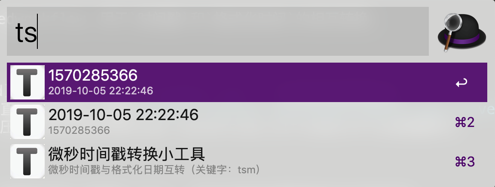
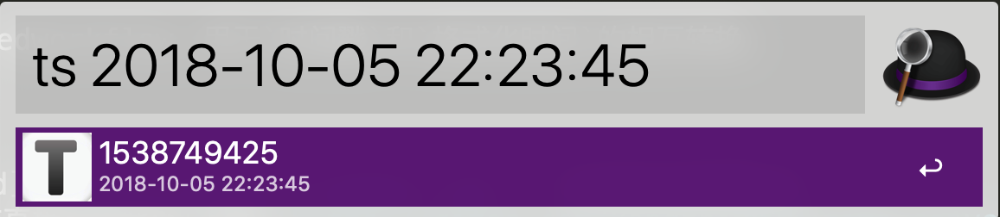
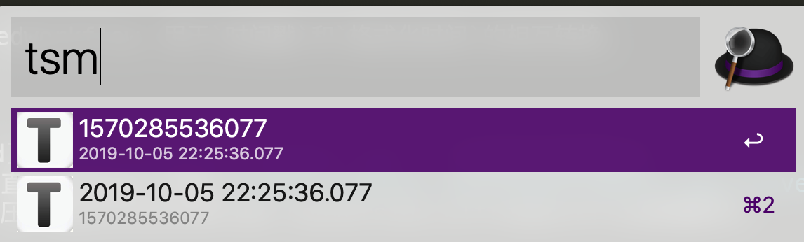
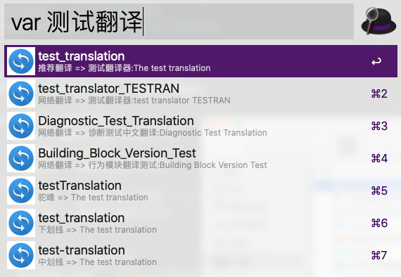
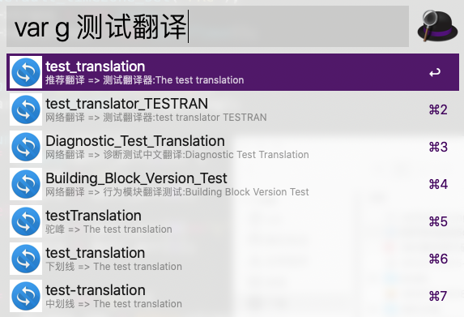
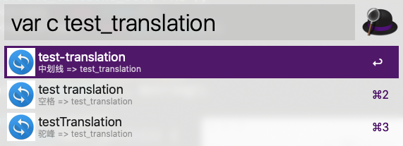

# conversion-tools
用于时间戳和变量等的转换。。。

开发基于 `PHP`、 `有道翻译api`;

# 依赖
- Alfred 3 
- PHP 5.6+

# 安装
[点击下载](https://github.com/kangzhi2016/conversion-tools/releases)

# 效果 

### 时间转换

> 默认在alfred搜索框中输入关键字 “ts” ，显示当前时间戳和格式化后的时间。

> 

> 在关键字 “ts”后输入**空格**+要转换的时间，即可在列表中得到想要的时间格式，选中想要的格式，回车就复制到剪切板了。
 
> 

> 获取 13 位微妙时间戳，用法同上，只是关键字为 “tsm”。

> 

### 变量转换

> 在关键字 “var”后输入**空格**+ 中文变量名，即可在列表中得到想要的变量翻译和几种常见的变量形式，如驼峰和下划线等，
> 选中想要的格式，回车就复制到剪切板了。默认关键字 “var”后的参数“g”可不加
 
> 
> 

> 在关键字 “var”后输入**空格**+ 参数“c” + 需要转换的变量名，即可得到另外几种不同形式的变量名。

> 

# 其他作品

[time-conversion-alfredworkflow](https://github.com/kangzhi2016/time-conversion-alfredworkflow) 用于时间戳和格式化时间的相互转换的小工具。

本工具结合了时间转换和变量转换。

